# 🛒 GlamStar — Flutter E-Commerce App

A full-featured e-commerce mobile application built with Flutter, designed to deliver a seamless shopping experience on Android

---

## 📱 Screenshots

<table>
  <tr>
    <td align="center"><strong>Login Screen</strong></td>
    <td align="center"><strong>Signup Screen</strong></td>
    <td align="center"><strong>Home Screen</strong></td>
  </tr>
  <tr>
    <td>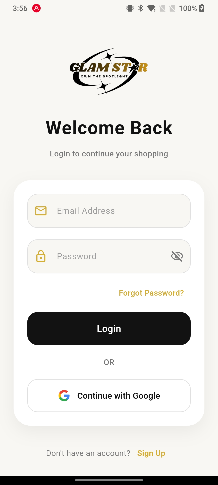</td>
    <td>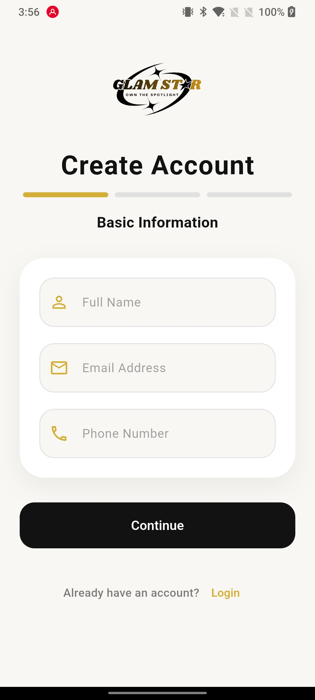</td>
    <td></td>
  </tr>
<tr>
    <td align="center"><strong>Product List</strong></td>
    <td align="center"><strong>Product Detail</strong></td>
    <td align="center"><strong>Product Info</strong></td>
  </tr>
  <tr>
    <td>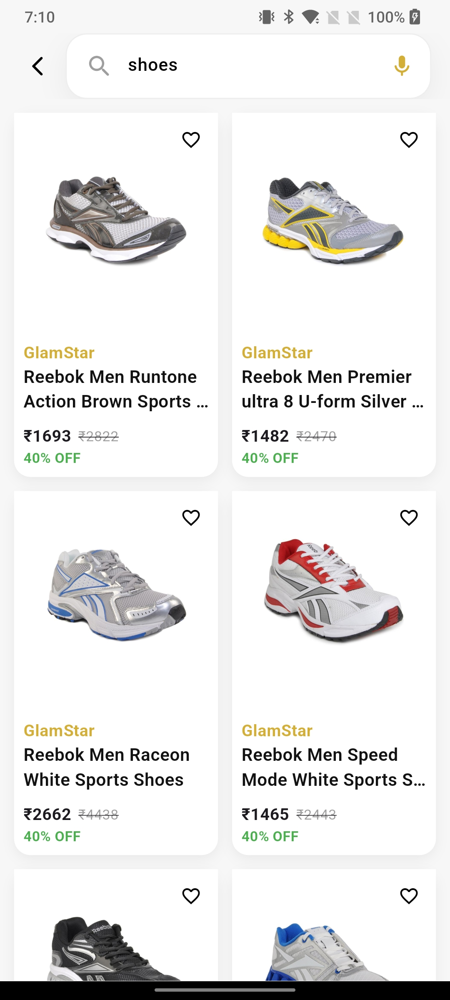</td>
    <td>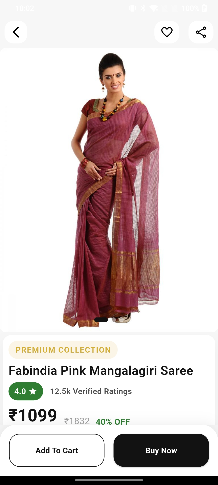</td>
    <td>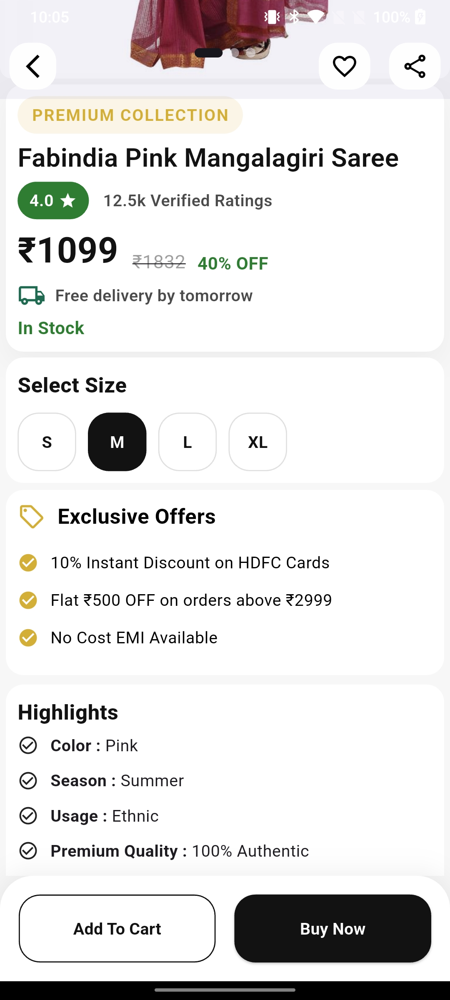</td>
  </tr>
  <tr>
    <td align="center"><strong>Cart</strong></td>
    <td align="center"><strong>Checkout</strong></td>
    <td align="center"><strong>Payment</strong></td>
  </tr>
  <tr>
    <td>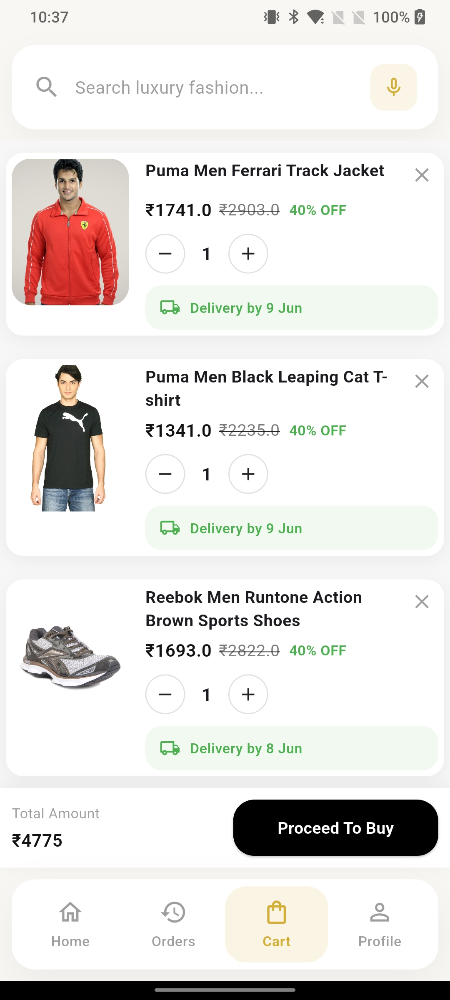</td>
    <td>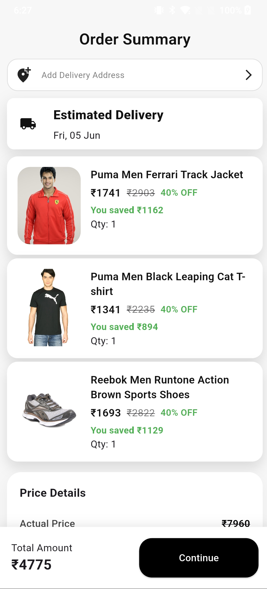</td>
    <td>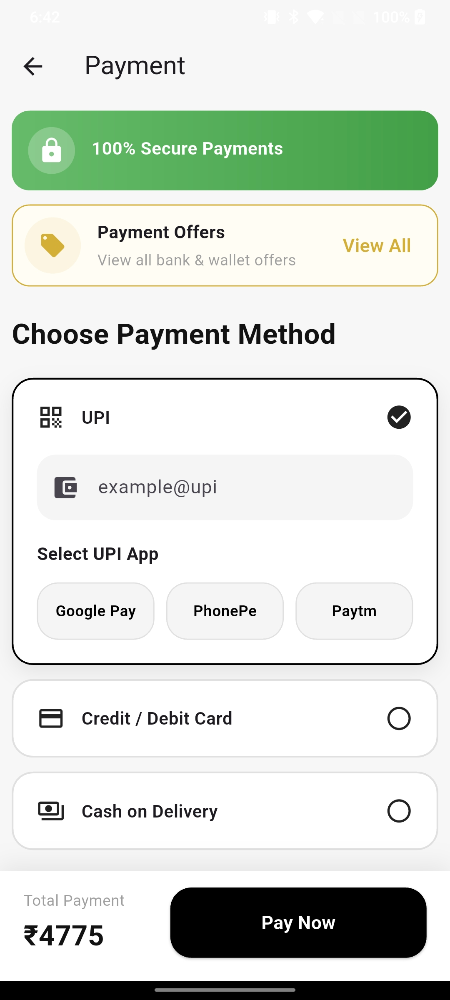</td>
  </tr>
  <tr>
    <td align="center"><strong>Order History</strong></td>
    <td align="center"><strong>Profile</strong></td>
    <td align="center"><strong>Edit Profile</strong></td>
  </tr>
  <tr>
    <td>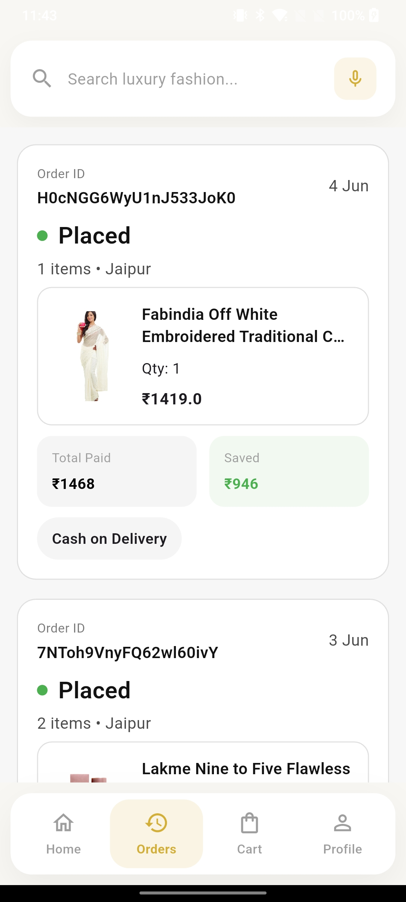</td>
    <td>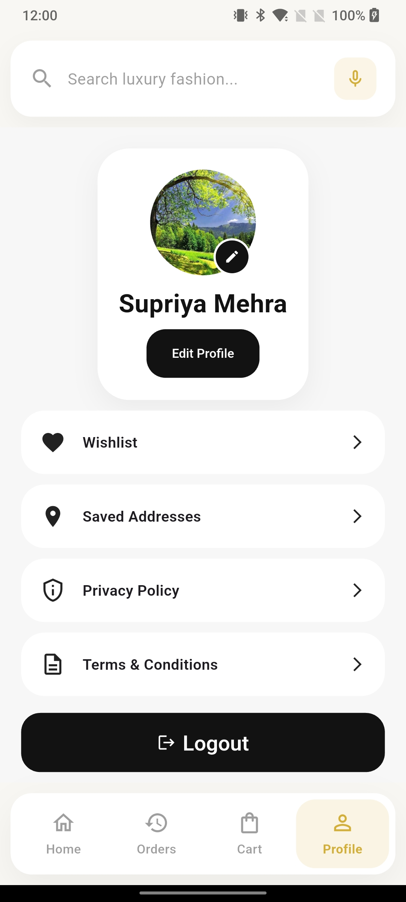</td>
    <td>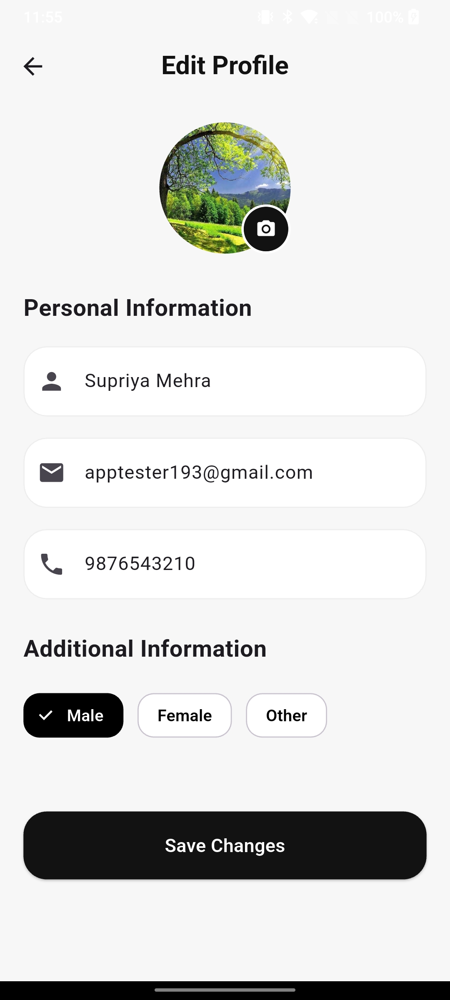</td>
  </tr>
</table>

---

## ✨ Features

- 🏠 **Home Feed** — Banners, featured products, and category highlights
- 🔍 **Search & Filter** — Find products by name, category, or price range
- 📦 **Product Listing** — Grid/list view with sorting options
- 🛍️ **Product Detail** — Images, description, ratings, and reviews
- 🛒 **Cart Management** — Add, remove, and update item quantities
- ❤️ **Wishlist** — Save products for later
- 👤 **User Authentication** — Sign up, login, and profile management
- 📋 **Order History** — Track past orders and their statuses
- 📱 **Responsive UI** — Optimized for various screen sizes

---

## 🚧 Not Yet Implemented

| Feature | Status | Notes |
|---|---|---|
| Payment Gateway | ❌ Pending | Razorpay / Stripe integration planned |
| Push Notifications | 🔄 In Progress | FCM setup pending |
| Product Reviews | 🔄 In Progress | UI done, backend pending |

---

## 🛠️ Tech Stack

| Layer | Technology |
|---|---|
| Framework | Flutter (Dart) |
| State Management | Provider / Riverpod * |
| Backend / API | REST API / Firebase *(update as applicable)* |
| Local Storage | SharedPreferences / Hive |
| Navigation | GoRouter / Navigator 2.0 |
| Image Loading | cached_network_image |

---

## 📁 Project Structure

```
lib/
├── main.dart
├── firebase_options
├── src/
│   ├── app/
│   ├── common/
│   ├── features/
│   ├── services/
│   ├── test/
│   └── wishlist/

       
assets/
├── fonts/
├── images/
└── screenshots/
```

---

## 🚀 Getting Started

### Prerequisites

- Flutter SDK `>=3.0.0`
- Dart SDK `>=3.0.0`
- Android Studio 
- physical device

### Installation

1. **Clone the repository**

   ```bash
   git clone https://github.com/your-username/glamstar.git
   cd glamstar
   ```

2. **Install dependencies**

   ```bash
   flutter pub get
   ```

3. **Configure environment**

   Create a `.env` file or update `lib/app/config.dart` with your API base URL and keys.

4. **Run the app**

   ```bash
   flutter run
   ```

---

## 🧪 Running Tests

```bash
# Unit & widget tests
flutter test

# Integration tests
flutter test integration_test/
```

---

## 📦 Building for Release

```bash
# Android APK
flutter build apk --release

# Android App Bundle
flutter build appbundle --release

# iOS
flutter build ios --release
```

---

## 👨‍💻 Author

**Jaya Yadav**
- GitHub: [jayayadav25](https://github.com/jayayadav25)

---

